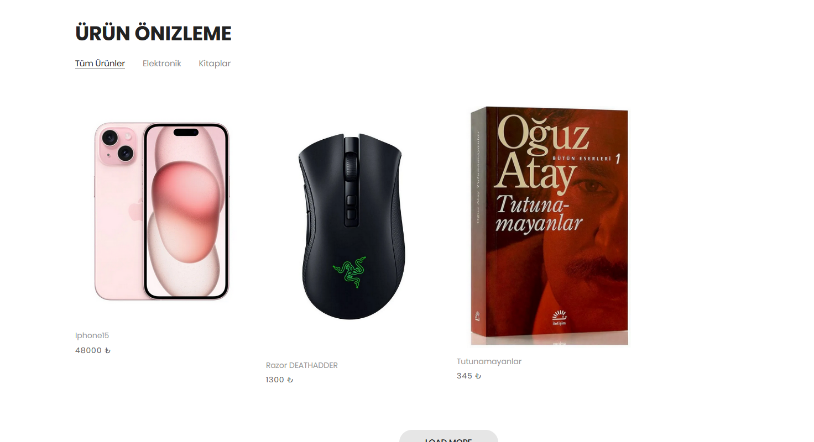
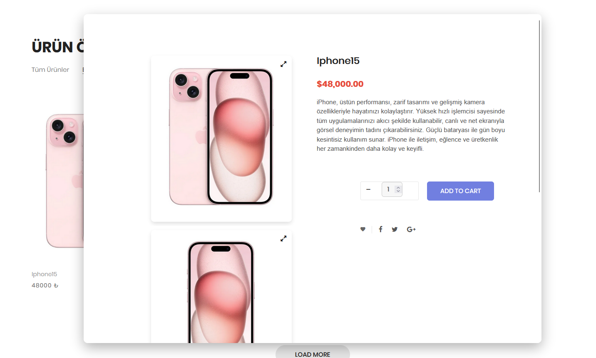
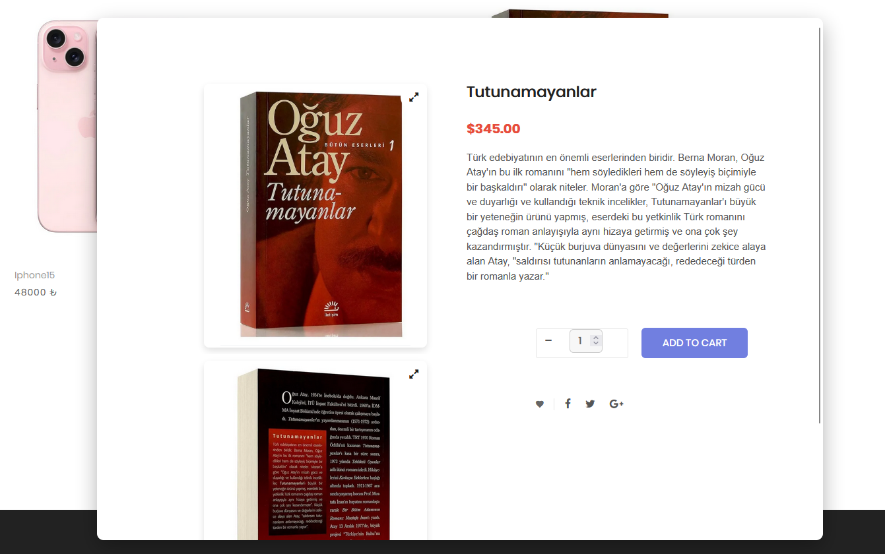
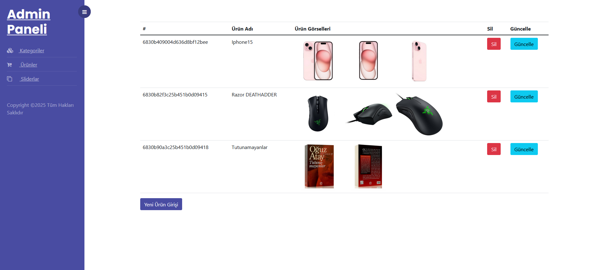
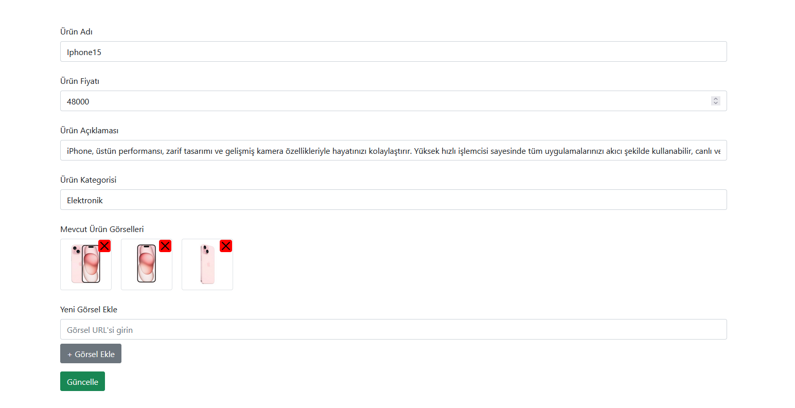
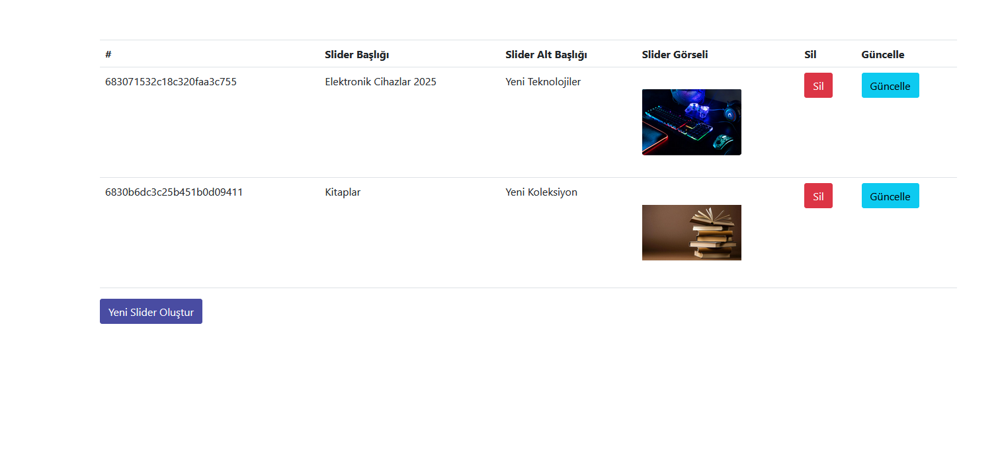

  

# 🛒 MongoDBCase E-Ticaret Web Uygulaması

Bu proje, MongoDB veritabanı ve ASP.NET Core MVC mimarisi kullanılarak geliştirilmiş, modern bir e-ticaret web uygulamasıdır.  
Kullanıcılar ürünleri inceleyebilir, slider ile öne çıkan kampanyaları görebilir, e-posta ile indirim kuponu alabilir.  
Admin paneli üzerinden ürün, kategori ve slider yönetimi yapılabilir.

---

## ✨ Temel Özellikler

- MongoDB ile NoSQL veri modeli
- Ürün, kategori ve slider yönetimi
- E-posta abonelik sistemi (%20 indirimli)
- Component ve Partial View mimarisi
- Service ve DTO (Data Transfer Object) katmanları
- Asenkron veri işlemleri
- Admin panel üzerinden içerik yönetimi

---

## 🧩 Mimari Yapı

### 🔹 Katmanlar

- **Controllers**: Kullanıcı isteklerini işler ve servisleri çağırır.
- **Services**: Veritabanı işlemlerini kapsüller.
- **DTOs**: View ile model arasında veri taşıma görevini üstlenir.
- **Views**: Razor Pages ile yazılmış kullanıcı arayüzü.
- **Partials/Components**: Reusable HTML bileşenleri (örneğin: slider, ürün önizleme).

### 🔹 MongoDB Veri Yapısı

MongoDB'de 3 ana koleksiyon kullanıldı:

- `Products` (ProductId, ProductName, Price, Description, CategoryId)
- `Categories` (CategoryId, CategoryName)
- `Sliders` (SliderId, Title, ImageUrl)

İlişkiler, **referans ID** üzerinden (foreign key benzeri) kurgulandı.  
Örneğin, bir ürün `CategoryId` içererek Category koleksiyonuyla ilişkilendirilir.

---

## 📬 E-Posta Aboneliği (%20 İndirim)

Kullanıcılar e-posta adreslerini bırakarak otomatik olarak indirim kuponu alırlar.  
Gmail SMTP üzerinden gönderim yapılır ve uygulama şifresi ile güvenli bağlantı sağlanır.

- E-posta formatı: `Merhabalar [isim], kodunuz: ABCD1234`
- Kodlar rastgele üretilir (8 karakter alfanümerik)
- `SmtpClient` kullanılmıştır (alternatif: `MailKit`)

---

## 🧪 Kullanılan Teknolojiler

- ASP.NET Core MVC
- MongoDB (NoSQL)
- SMTP (Gmail App Password)
- Bootstrap 5
- C# 10
- JavaScript (AJAX - Fetch API)
- LINQ, Async/Await, DTO Pattern

---

## 📸 Uygulama Görselleri

### 🎞️ Slider Alanı (Anasayfa)

| Slider 1 | Slider 2 |
|:--------:|:--------:|
|  |  |

### 🛍️ Ürün Önizleme ve Detay

| Ürün Önizleme 1 | Ürün Önizleme 2 | Ürün Detay |
|:---------------:|:---------------:|:-----------:|
|  |  |  |

### 🛠️ Admin Panel Ekranları

| Slider Yönetimi | Ürün Ekleme | Kategori Güncelleme |
|:---------------:|:------------:|:--------------------:|
|  |  |  |

---

